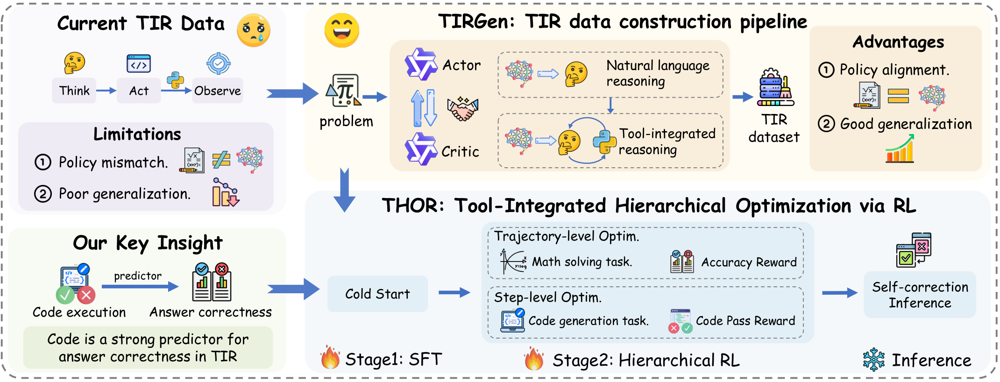
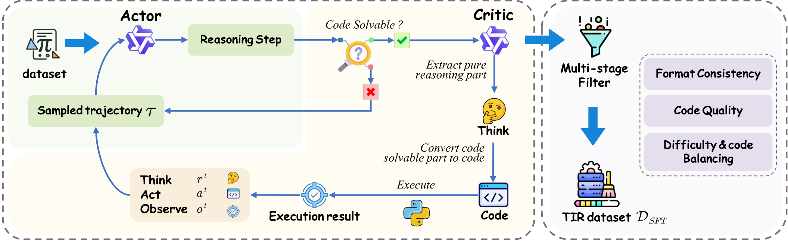
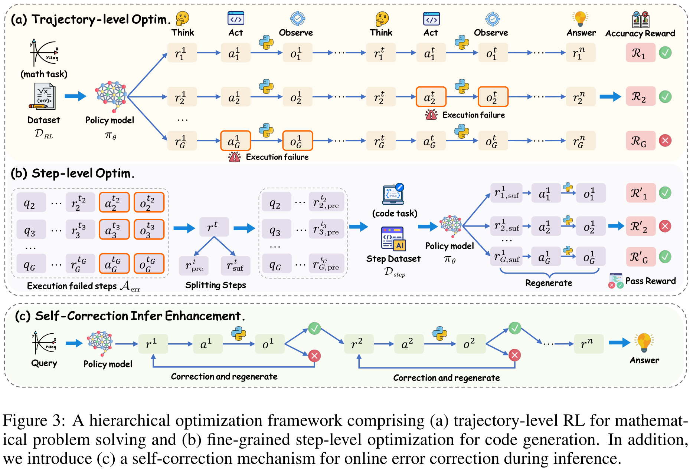
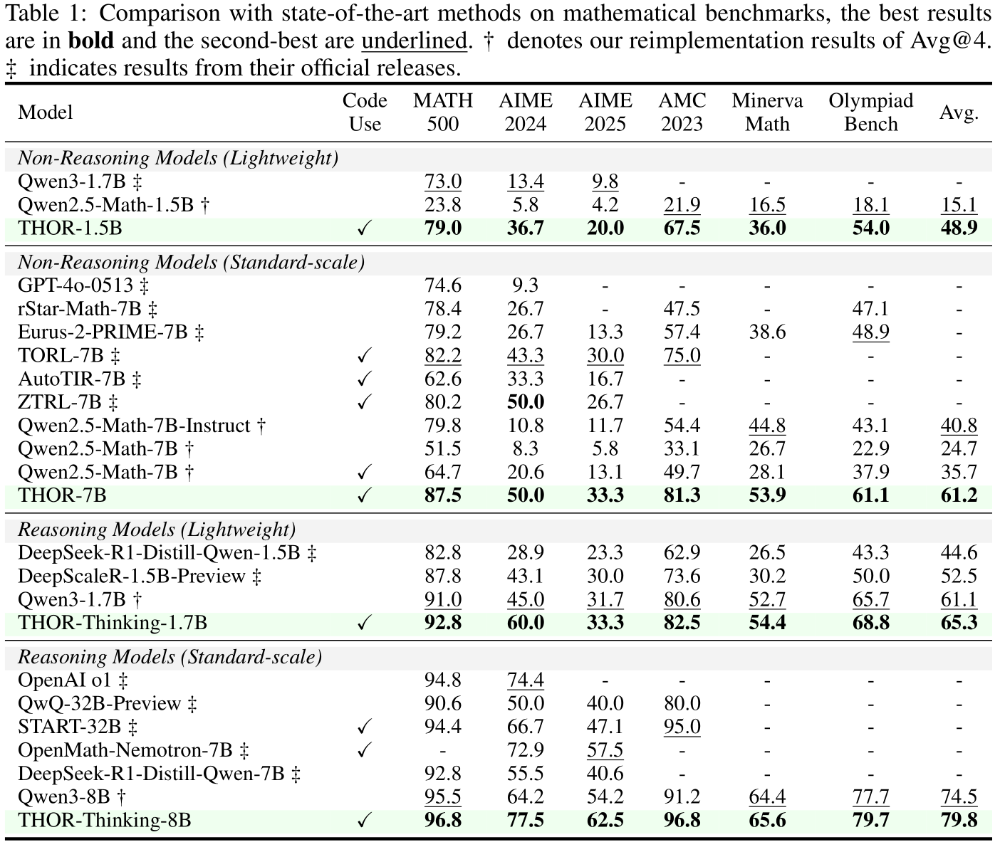
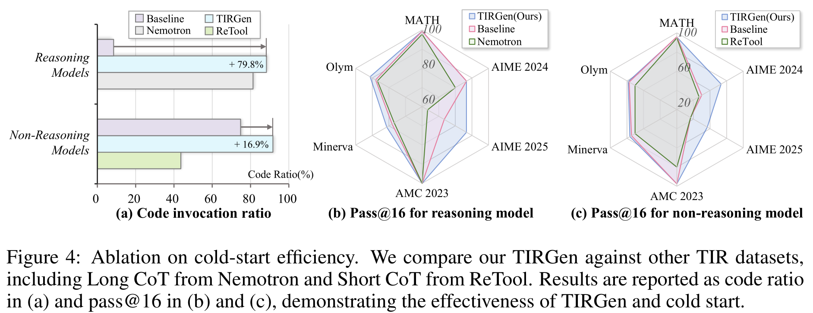
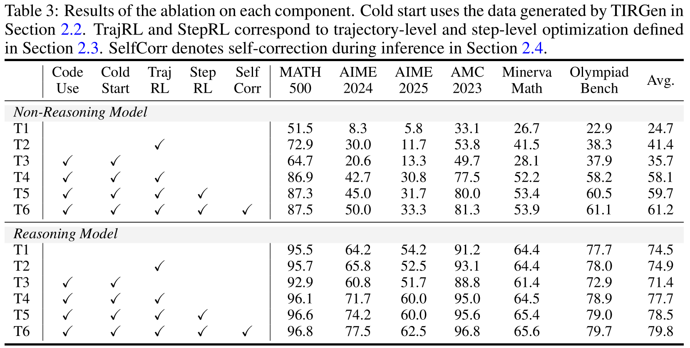

# 🚀 THOR: Tool-Integrated Hierarchical Optimization via RL for Mathematical Reasoning 🚀


[](https://arxiv.org/abs/2509.13761)
[](https://huggingface.co/papers/2509.13761)



This is the official implementation of our paper **THOR: Tool-Integrated Hierarchical Optimization via RL for Mathematical Reasoning**.

## :fire: News:

TODO:
- [x] Update arXiv preprint.
- [ ] Update inference code.
- [ ] Update training code.
- [ ] Update the cold start dataset.

## 🔍 Overview
Large Language Models (LLMs) have advanced in mathematical reasoning but still struggle with precise computation and symbolic manipulation. THOR (Tool-Integrated Hierarchical Optimization via RL) addresses this by:

1. TIRGen – an actor–critic pipeline to construct high-quality tool-integrated reasoning data.
2. Hierarchical RL – jointly optimizing trajectory-level reasoning and step-level code generation.
3. Self-Correction – leveraging tool feedback to fix reasoning errors during inference.

THOR achieves state-of-the-art performance on multiple mathematical benchmarks and shows consistent improvements on code generation tasks, generalizing well across both reasoning and non-reasoning models.

## ✨ Key Contributions
1. 🛠 TIRGen Pipeline – Generates policy-aligned tool-integrated reasoning data.
2. 🎯 Hierarchical RL – Combines trajectory-level optimization with step-level correction.
3. 🔄 Self-Correction Inference – Dynamically fixes reasoning errors during inference.
4. 📊 Broad Generalization – Effective across reasoning and non-reasoning models.

## ⚙️ Method
Our method, THOR, enhances tool-integrated reasoning with a three-stage pipeline:

1️⃣ TIRGen: Tool-Integrated Data Construction
- Actor generates natural language reasoning steps.
- Critic evaluates whether parts of the reasoning can be executed as code.
- Identified steps are transformed into tool-augmented reasoning paths.
- Multi-stage filtering ensures policy alignment, code quality, and difficulty balance.



2️⃣ Hierarchical Reinforcement Learning
- Trajectory-level RL: Optimizes overall correctness of the final answer using GRPO.
- Step-level RL: Focuses on error-prone code generation steps, using execution results as fine-grained rewards.
- Joint optimization addresses sparse reward issues in long reasoning chains.



3️⃣ Self-Correction During Inference
- During inference, if a tool call fails, the model backtracks to the reasoning step.
- It regenerates a new suffix and revised action, guided by tool feedback.
- This enables online error correction with minimal overhead.

## 📊 Results

### Comparison With State-of-the-Art Methods


### Effectiveness of TIRGen


### Ablation Study



## 📥 Installation
```python
# TODO
```

## 🚀 Usage
Inference Example
```python
# TODO
```


## 🙌 Acknowledgements
We thank the open-source community from [Qwen](https://github.com/QwenLM/Qwen), [verl](https://github.com/volcengine/verl) and [SandboxFusion](https://github.com/bytedance/SandboxFusion).


## 🖊️ Citation
If you find our work helpful, please consider giving us a ⭐ and citing our paper:
```
@article{THOR,
  title={THOR: Tool-Integrated Hierarchical Optimization via RL for Mathematical Reasoning},
  author = {Chang, Qikai and Zhang, Zhenrong and Hu, Pengfei and Ma, Jiefeng and Pan, Yicheng and Zhang, Jianshu and Du, Jun and Liu, Quan and Gao, Jianqing},
  journal={arXiv preprint arXiv:2509.13761},
  year={2025}
}
```


